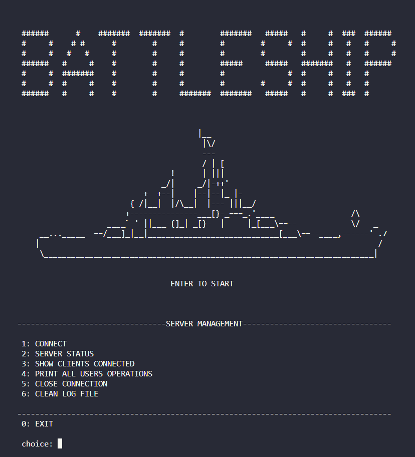
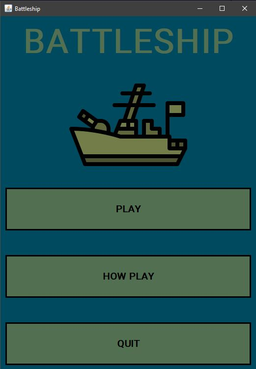
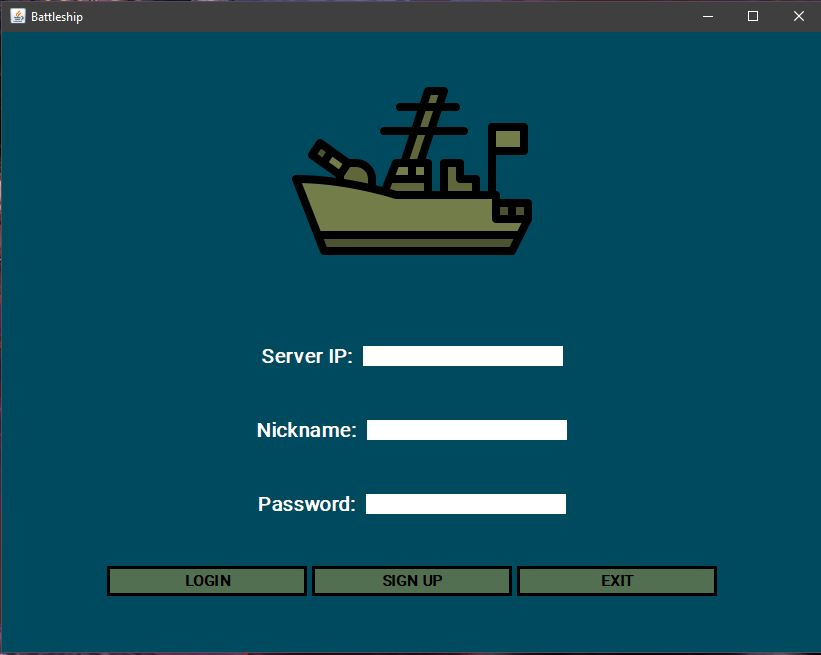

# `<Battleship in Java>`

## Description

A digital reproduction of the board game Battleship.

This project has been developed as a school project for learning Sockets in Java.

## Technologies used

**Java 19**: programming languange used for the code

**TCP Sockets**: Transmission Control Protocol has been used for the Client-Server communication, as it was required by the exercise delivery.

**Java Swing**: for the graphics, in order to develop all the users' screens.

## How run the program

For testing the project, just import battleship folder in VS Code:

- Run **Server.java** for running the server, where users will connect to.
- Run **Main.java** for playing the game.

## How play the game

### Connection

After setting up the server (1 - for connecting, 2 - for showing server ip)

Users can connect using server ip. (After signing up, users are saved from the Server into res/txt/users.txt as username;password)

### Starting a new match

After login, each user can send a request for playing to another user for starting a new match.

(Select the user's nickname you want to play with and click on play. If the other user accepts your request, the match starts)

### Managing ships position

Now, each user can manage his ships position:

- **left mouse click** for selecting the ship to move
- **left click again** to confirm the new position
- **right click** for turning the ship

After each user has clicked on START, game starts and every user can send attacks to the opponent, by clicking on the opponent grid.

Game ends when the ships of one of the two are sunk all.

Furthermore, users can communicate using the chat, where events are also shown.

### Additional features

- Before starting the match, player can use RANDOM POSITIONING button for setting up the ships randomly.
- When one of the user disconnects from the Server, the other player is advised with an alert and match ends.
- All clients' operations (connect, disconnect, game events, messages) are stored in res/txt/logs.txt file and the server can view them using PRINT ALL USERS OPERATIONS (4) command.
